# bamazon
bamazon CLI node js shopping APP 

# Project overview
Amazon like store front to buy products and view product sales and so on. Which uses mysql as backend database to store the data.

# 1: Customer View

 Welcome to BAMAZON Store CustomerView! 
  1) View Products for sale
  2) Buy Products
  3) Exit App

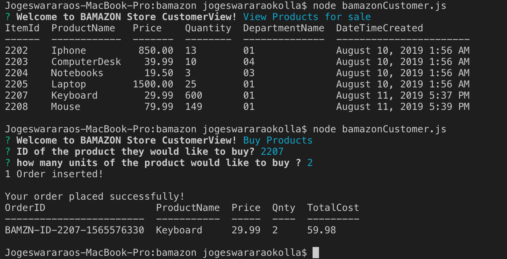
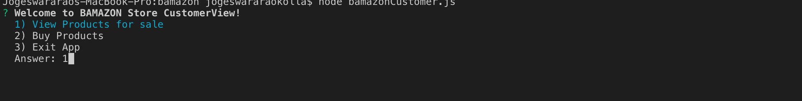
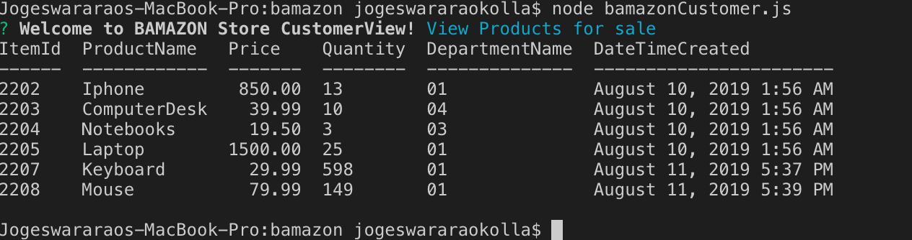
  
# 2: Manager View 

 Welcome to BAMAZON Store ManagerView! 
 1) View Products for Sale 
 2) View Low Inventory 
 3) Add to Inventory 
 4) Add New Product 
 5) Exit App 

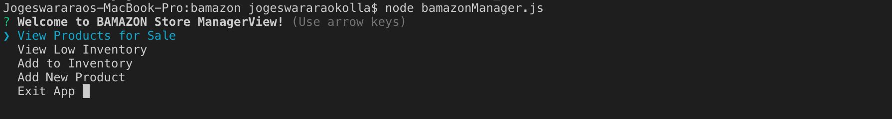
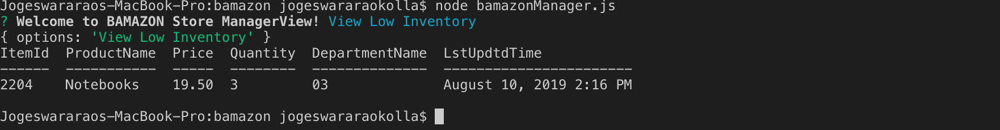
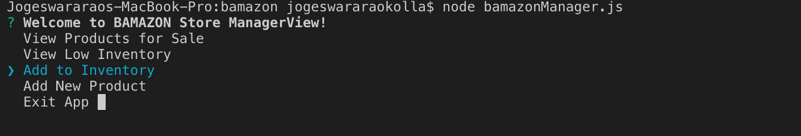
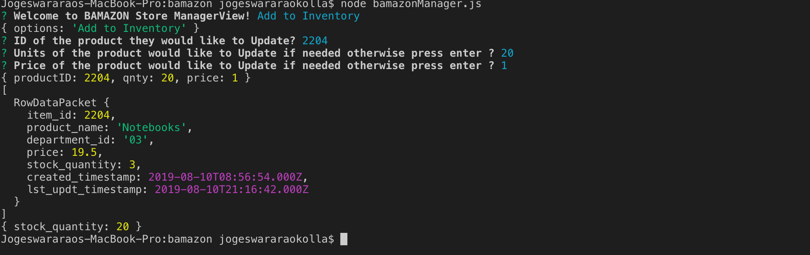
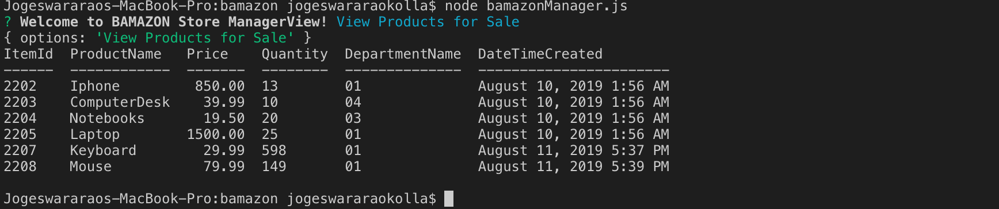
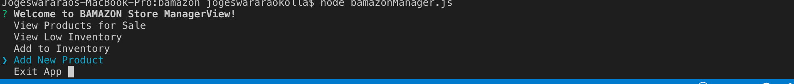
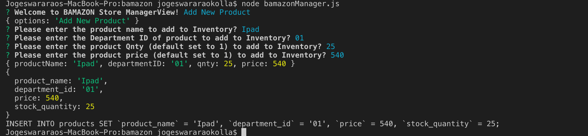
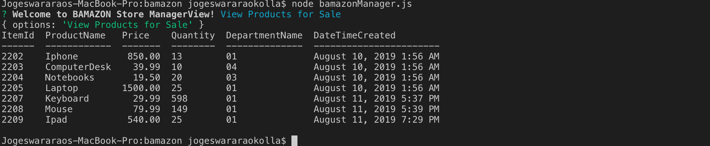

# 3: Supervisor View
 Welcome to BAMAZON Store SupervisorView! 
  1) View Product Sales by Department
  2) Create New Department
  3) Remove a Department
  4) Exit App

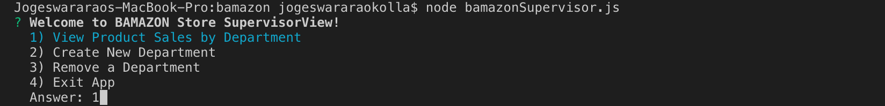
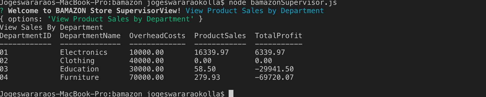
